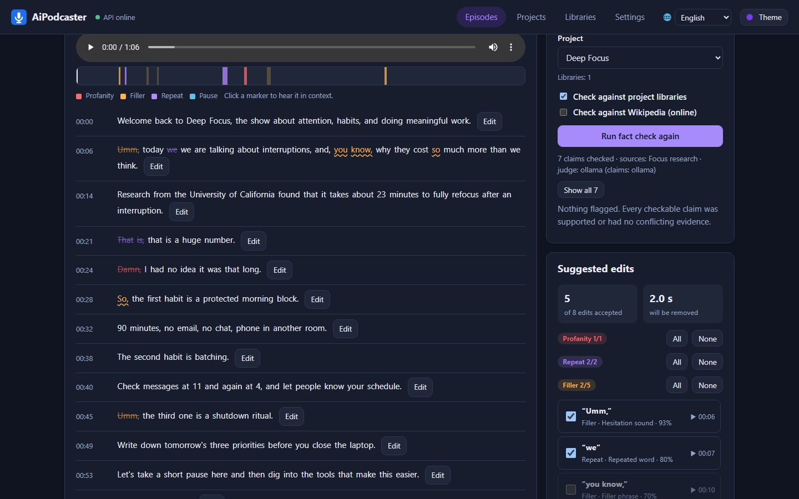
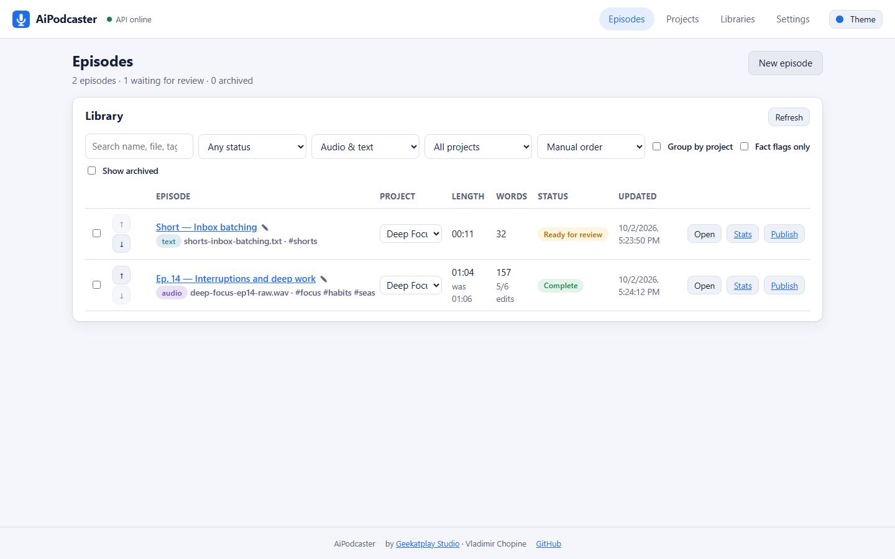
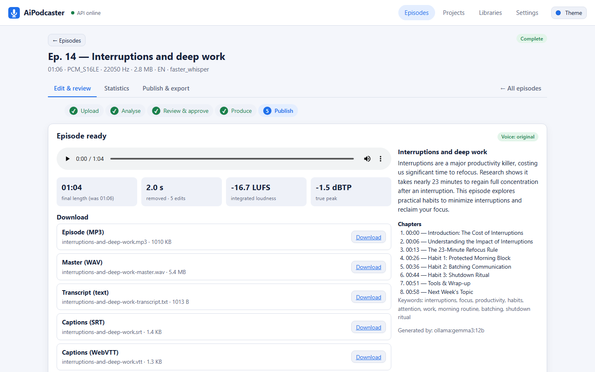
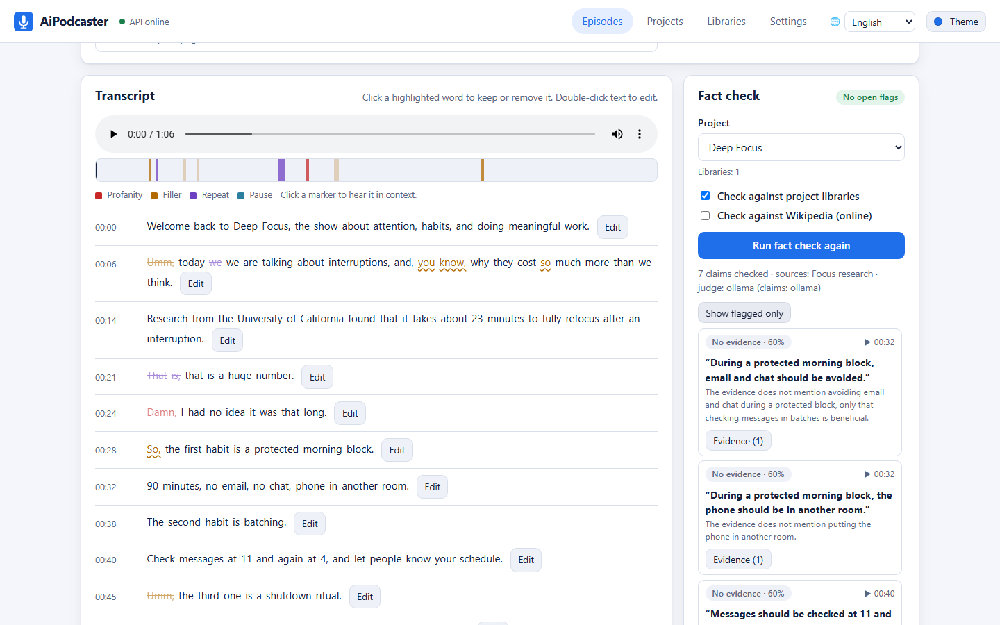
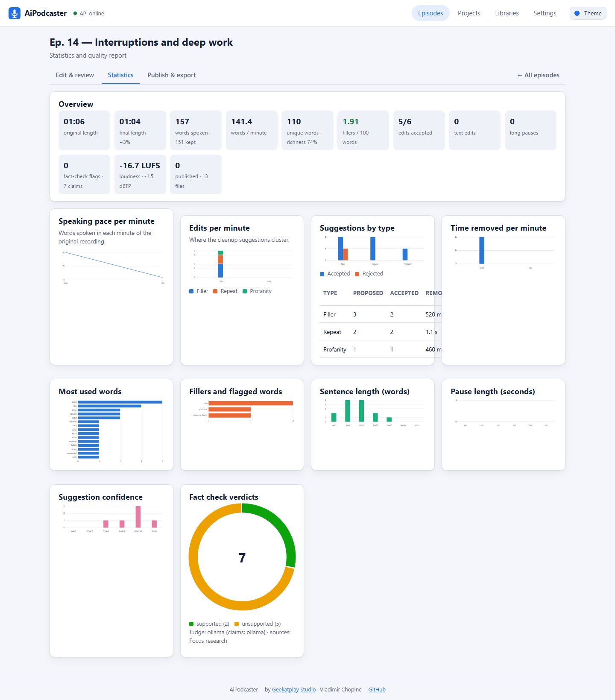
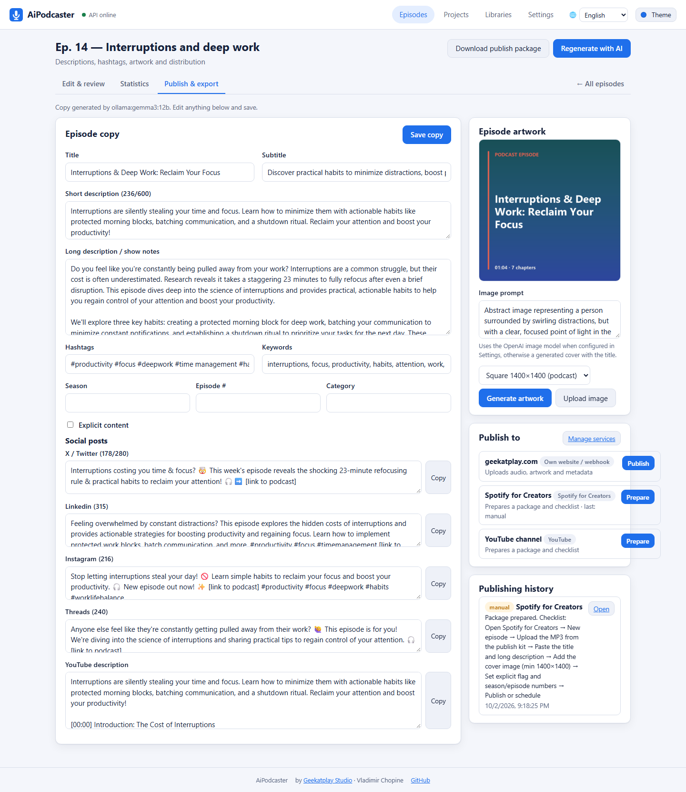
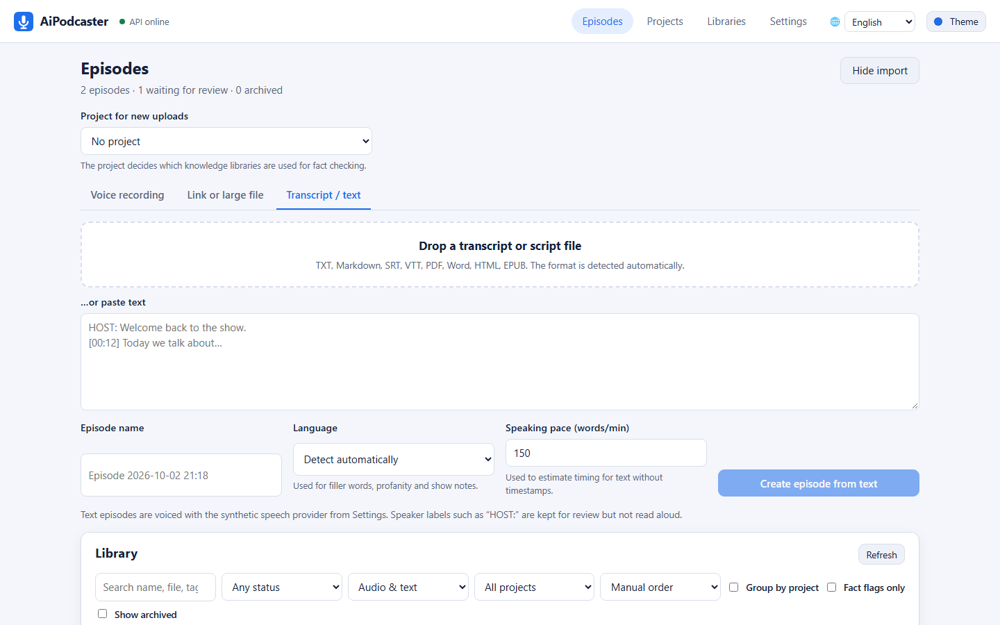
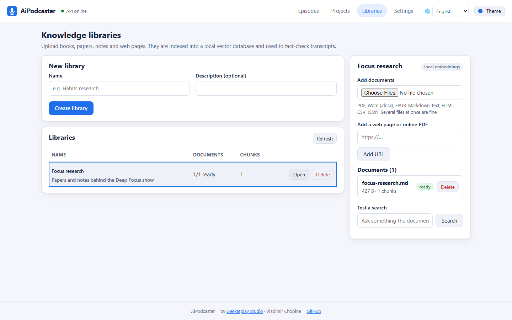
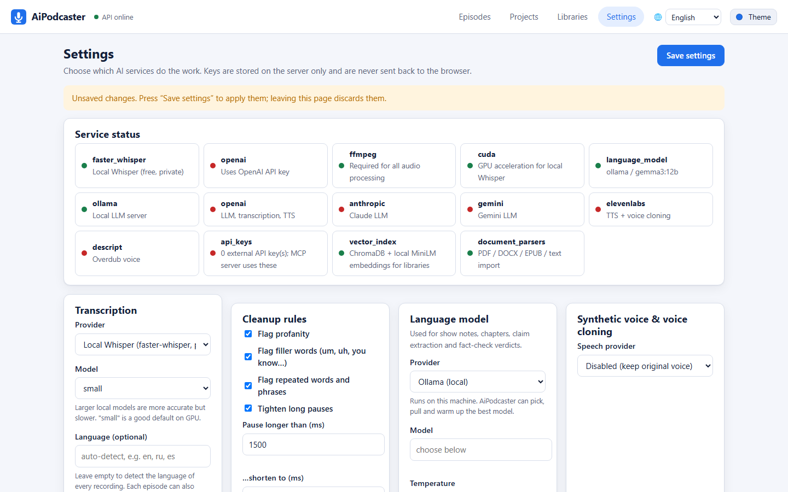

<div align="center">


# AiPodcaster

**Review-first podcast post-production.**
Drop a raw recording or a transcript, get a cleaned, fact-checked, mastered episode with artwork, show notes and a publish kit, and push it to your hosting service or website.

[](LICENSE)
[](backend/)
[](backend/)
[](web/)
[](web/)
[](docs/testing.md)
[](#providers)

by **Geekatplay Studio** · Vladimir Chopine



</div>

---

## Why AiPodcaster

Most cleanup tools cut first and ask later. AiPodcaster never changes your recording without you seeing exactly what will go: every filler, stutter, profanity and long pause is a **proposal** with a reason, a confidence and a one-click preview. You approve, then it renders. The same review loop covers **fact checking** against your own reference library and Wikipedia, so what your show says is as clean as how it sounds.

Everything runs on your machine by default. Cloud models are optional, pluggable and keyed from a settings page, never from code.

## Highlights

| | |
| --- | --- |
| **Any input** | Audio or video (WAV, MP3, M4A, FLAC, OGG, WEBM, MP4, MOV), links (YouTube, Vimeo, podcast pages, direct media URLs), multi-gigabyte files imported straight from disk, or text: paste a transcript, or drop TXT, Markdown, SRT, VTT, PDF, Word, HTML, EPUB. Captions, timestamps, speaker dialogue and prose are detected automatically. |
| **Transparent cleanup** | Profanity (+ custom words), filler words and phrases, repeated words, long pauses. Click a word to keep or remove it, accept or reject by category, edit the text inline while timing is preserved. |
| **Fact checking (RAG)** | Build knowledge libraries from books, papers and web pages (local ChromaDB vector index). Projects pick which libraries to trust and can inherit other projects' libraries. Claims are extracted, matched against evidence and Wikipedia, and contradictions are flagged with sources. |
| **Production** | Micro-faded cuts from the original voice, or a synthetic voice reading the approved text. EBU R128 loudness mastering, true-peak ceiling, MP3 and WAV master. Clone your own voice from the recording with ElevenLabs. |
| **Publish kit** | Transcript, SRT and WebVTT captions, chapters, show notes, metadata JSON, edit decision list, fact-check report, RSS item, all zipped. |
| **Publish screen** | Model-written title, descriptions, hashtags, social posts and YouTube description; generated or uploaded artwork; one-click publishing to your own website (webhook + PHP receiver), WordPress, Buzzsprout and Transistor; checklists and packages for Spotify, Apple Podcasts and YouTube. |
| **Statistics** | Speaking pace, vocabulary richness, fillers per 100 words, edits by type and confidence, time removed per minute, pause and sentence distributions, fact-check verdicts, loudness. |
| **Library** | Search, filter, sort, drag to reorder, group by project, inline rename, archive, bulk actions. |
| **Providers** | Local Whisper or OpenAI for transcription. Ollama (auto-detects, picks, pulls and warms the best model for your GPU), Anthropic, OpenAI, Gemini or any OpenAI-compatible server for language tasks. OpenAI, ElevenLabs, Descript or a custom HTTP endpoint for speech. |
| **Automation** | Keyed REST API with interactive docs and a Model Context Protocol server exposing 21 tools to assistants and agents. |
| **Themes** | Light, dark and system mode with six accent palettes. |

## Screenshots

<table>
  <tr>
    <td width="50%"><br /><sub><b>Episode library</b> · search, filter, group, reorder, archive</sub></td>
    <td width="50%"><br /><sub><b>Review workspace</b> · proposals on the timeline and in the transcript</sub></td>
  </tr>
  <tr>
    <td><br /><sub><b>Fact check</b> · claims, verdicts, evidence from your libraries</sub></td>
    <td><br /><sub><b>Statistics</b> · pace, edits, vocabulary, pauses, verdicts</sub></td>
  </tr>
  <tr>
    <td><br /><sub><b>Publish &amp; export</b> · copy, artwork, hosting services, history</sub></td>
    <td><br /><sub><b>Text import</b> · paste or drop a transcript, format detected</sub></td>
  </tr>
  <tr>
    <td><br /><sub><b>Knowledge libraries</b> · documents indexed into a local vector store</sub></td>
    <td><br /><sub><b>Settings</b> · providers, Ollama auto-setup, publishing services, API keys</sub></td>
  </tr>
</table>

## Quick start

Requirements: **Node.js 22.12+**, **Python 3.12+**, **FFmpeg/FFprobe** on `PATH`. An NVIDIA GPU is optional; it makes local transcription several times faster. [Ollama](https://ollama.com) is optional for a fully local language model.

```powershell
# Windows
.\scripts\install.ps1
.\scripts\start.ps1        # web http://localhost:5173 · API docs http://127.0.0.1:8000/docs
.\scripts\stop.ps1
```

```bash
# macOS / Linux
chmod +x scripts/*.sh
./scripts/install.sh
./scripts/start.sh
./scripts/stop.sh
```

1. Open **Settings** once: pick a transcription provider (local Whisper works out of the box), optionally a language model (press *Prepare best model* under Ollama) and a speech provider.
2. On **Episodes**, drop a recording, paste a link, point at a large file on disk, or paste a transcript.
3. Review the proposals, run a fact check, approve.
4. Open **Publish & export**, generate the copy and artwork, publish.

The full walkthrough is in the [user manual](docs/user-manual.md).

## How it works

```
 upload / paste ─▶ ingest ─▶ transcribe ─▶ propose edits ─▶ REVIEW & APPROVE ─▶ render ─▶ publish kit ─▶ publish
                  FFprobe    Whisper or     fillers, repeats,  you decide every   FFmpeg cuts   captions, notes   website, WordPress,
                  magic      OpenAI;        profanity, pauses, cut; fact check    + loudnorm,   chapters, RSS,    Buzzsprout, Transistor,
                  bytes      text formats   show notes         against libraries  or TTS        report, zip       manual checklists
```

- **Backend** `backend/` – FastAPI. Services for audio (FFmpeg, fixed argv), transcription, analysis, language models, speech, RAG (parsing, ChromaDB index, claims, verification), statistics, publishing connectors and an MCP server. Jobs persist as JSON per episode under `data/`.
- **Web** `web/` – React 19 + TypeScript on Vite 8. No UI framework; hand-written components, dependency-free SVG charts, CSS variables for themes.
- **Security** – sanitised names, UUID-only paths, size and duration limits, magic-byte checks, output allow-list, CORS, security headers, server-side secrets with masking, optional API keys for external access.

More detail: [architecture](docs/architecture.md) · [testing strategy](docs/testing.md) · [website connector contract](docs/website-connector/README.md).

## Providers

| Task | Local | Cloud |
| --- | --- | --- |
| Transcription | faster-whisper (CUDA or CPU) | OpenAI |
| Language model | Ollama, any OpenAI-compatible server | Anthropic, OpenAI, Gemini |
| Embeddings (libraries) | MiniLM via ChromaDB | OpenAI |
| Speech & voice cloning | custom HTTP endpoint | OpenAI, ElevenLabs (cloning), Descript |
| Artwork | generated title cover | OpenAI images |
| Fact-check sources | your libraries | Wikipedia |

Keys live in `data/settings.json` on the server and are only ever shown masked. Environment variables (`OPENAI_API_KEY`, `ANTHROPIC_API_KEY`, `GEMINI_API_KEY`, `ELEVENLABS_API_KEY`, `DESCRIPT_API_KEY`) work as fallbacks.

## API and MCP

Interactive API docs at `/docs`. Generate a key under *Settings → API & MCP access* and send it as `X-API-Key`. The MCP server wraps the API for assistants and IDE agents:

```powershell
$env:AIPODCASTER_API_KEY = "apk_..."
.\scripts\mcp.ps1                    # stdio
.\scripts\mcp.ps1 -Http -Port 8765   # streamable HTTP
.\scripts\mcp.ps1 -PrintConfig       # client configuration snippet
```

Tools include `upload_recording`, `get_job`, `edit_transcript`, `approve_and_render`, `run_fact_check`, `list_outputs`, `create_library`, `add_documents`, `search_library`, `create_project`, `ollama_setup` and `test_language_model`.

## Configuration

| Variable | Default | Purpose |
| --- | --- | --- |
| `AIPODCASTER_DATA_DIR` | `./data` | Settings, uploads, outputs, libraries, vectors |
| `AIPODCASTER_MAX_UPLOAD_MB` / `AIPODCASTER_MAX_DURATION_MIN` | `8192` / `600` | Size and length limits for uploads, link downloads and local imports |
| `AIPODCASTER_ALLOW_LOCAL_IMPORT` | `1` | Allow importing files by absolute path on the server machine |
| `AIPODCASTER_ALLOWED_ORIGINS` | `http://localhost:5173,http://127.0.0.1:5173` | CORS |
| `AIPODCASTER_API_KEYS` | – | Extra API keys (comma separated) |
| `AIPODCASTER_PUBLIC_URL` | `http://127.0.0.1:8000` | URL written into publish manifests |
| `OLLAMA_HOST` | `http://127.0.0.1:11434` | Ollama server |
| `AIPODCASTER_TRANSCRIBER` | – | `fake` for deterministic tests |

## Tests

```powershell
.\scripts\test.ps1            # ruff · pytest · eslint · tsc · vitest
.\scripts\test.ps1 -E2E       # + Playwright browser flows (own ports, safe while the app runs)
.\scripts\test.ps1 -Mutation  # + mutmut on the deterministic modules
```

## Project layout

```
backend/   FastAPI app, services, RAG, publishing, MCP server, tests
web/       Vite + React client, unit and end-to-end tests
scripts/   install · start · stop · test · mcp (PowerShell and Bash)
docs/      user manual, architecture, testing, website connector, screenshots
```

## License

MIT © 2026 Geekatplay Studio, Vladimir Chopine. See [LICENSE](LICENSE).
